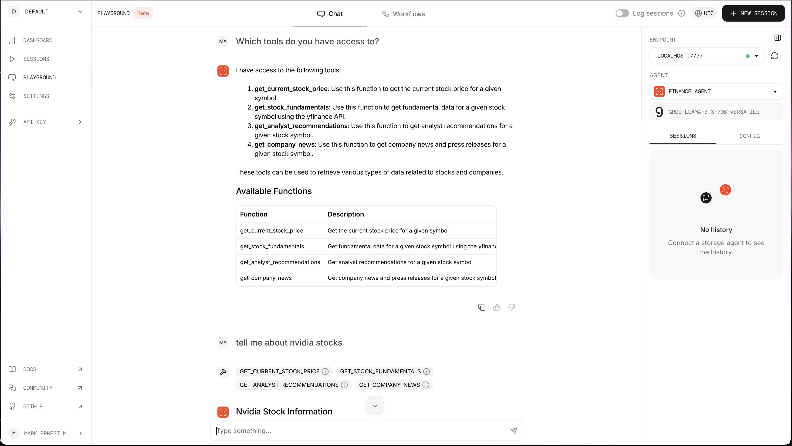

# AI Stocks Agent

## Screenshot
Here is a screenshot of the AI Stocks Agent in action:



## Overview
AI Stocks Agent is a powerful tool designed to help users analyze and predict stock market trends using advanced machine learning algorithms.

## Prerequisites
Before installing AI Stocks Agent, ensure you have the following prerequisites:

- OpenAI API key
- Groq account and API key
- Phidata account and API key

## Installation
To install AI Stocks Agent, follow these steps:

1. Clone the repository:
    ```bash
    git clone https://github.com/Inteligencia-Artificial-para-Filipinas/ai-stocks-agent
    ```
2. Navigate to the project directory:
    ```bash
    cd ai-stocks-agent
    ```
3. Install the required dependencies:
    ```bash
    pip install -r requirements.txt
    ```

## Usage
To start using AI Stocks Agent, run the following command:
```bash
python playground.py
```

